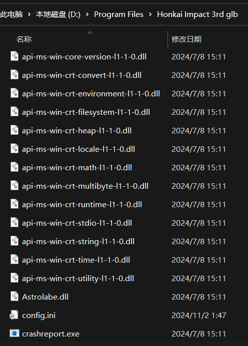

# HK3_stdio

某天我无聊的时候打开崩坏3的目录看文件，突然发现其中有一个：

One day when I was seeking for files in Honkai Impact 3rd's source files, I found that:

然后，在对Copilot的高强度骚扰下，dumpbin启动！lib工具启动！全部启动！

Then, with the help of Copilot, I used dumpbin, lib, and such, and...

随后，在不引用任何内置头文件的情况下，hk3_stdio.h可以执行stdio.h中常见的puts, gets, scanf, printf, fopen, fprintf, sscanf, sprintf等函数

The hk3_stdio.h file could launch those most_commonly used functions in stdio.h such as puts, gets, scanf, printf, fopen, fprintf, sscanf, sprintf WITHOUT INCLUDING ANY HEADERS

在启用前，请确保配置属性->链接器->附加依赖项中存在.../hk3_stdio.lib，并确保配置属性->VC++目录中存在当前文件夹，否则链接器无法将__declspec(dllimport)声明的函数和dll文件链接起来，造成无法运行的情况。另外，崩坏3的这个dll文件似乎是使用x86模式下编译的，所以请将配置管理器中的平台改为x86(WIN32)。

Before you start, make sure that you have added .../hk3_stdio.lib in the property->linker->additional dependencies, and make sure that the current folder is in the property->VC++ directories, otherwise the linker will not be able to link the functions declared by __declspec(dllimport) and the dll file, causing the program to fail to run. Also, this dll file of Honkai Impact 3rd seems to be compiled in x86 mode, so please change the platform in the configuration manager to x86(WIN32).
